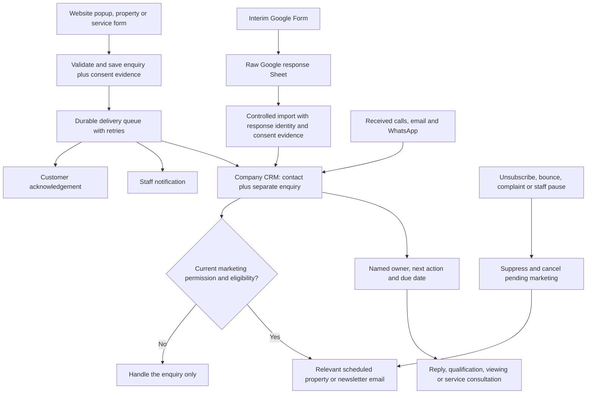

# Haus lead operations: journeys, responsibilities and delivery order

28 September 2026. Prepared for Deb, Sonia and Surya on cumulative Release 2 / draft PR #16.

**Objective:** every enquiry reaches a person who owns the next action, and eligible people can receive useful follow-up without staff repeatedly copying data. Google Forms/Sheets provides interim capture; the intended operating system is a company-owned CRM connected to the website and a company email service. A Sheet is usable at startup scale when ownership, status and follow-up are explicit. A raw list of responses alone does not supply that workflow.

This plan distinguishes source-verified implementation, live Google Form configuration, proposed operating rules and unbuilt features. The source audits were made at `cc4a8125`; the homepage false-success fix is included alongside this plan. Production website delivery, company mailbox coverage and campaign capability have not been verified. No CRM vendor or paid subscription is selected by this document.

## What changed during this review

- **Google Form consent corrected live.** The interim form now has optional, initially unchecked choices for matching-property emails and the Haus newsletter, using the website's existing wording. The published form and its linked Sheet headers were inspected. `Form responses 1!I1:J1` now contains those two question headings; the earlier synthetic receipt has blank choices in `I2:J2`. No new submission, campaign or subscriber import was performed. Full wording/evidence: [Form activation handoff](lead-activation-handoff-2026-09-28.md).
- **Homepage false receipt found and removed from the prepared code.** The lower Buy/Rent/Sell/Let widget collected details then displayed success without an API call. Its duplicate local forms have been replaced with the existing gated enquiry entry point. Buy and Rent retain their intent; Sell and Let use the existing combined `sell_let` contract. With intake off the cards lead to the honest unavailable enquiry page. This correction is not yet a production deployment.
- **Other journey gaps are now identified explicitly.** Rental footer/empty-result links can preselect Buy; search filters can be lost before enquiry; service routing, structured budgets and staff ownership are incomplete. These need code or operating-process changes, not just Railway variables. Full inventories: [visitor surfaces](lead-journey-surface-audit-2026-09-28.md), [backend](lead-journey-backend-audit-2026-09-28.md).

## Target workflow

The diagram is the target, not a claim that every connection exists. Today the website database/outbox can deliver staff notifications and a dedicated Google Sheet export. CRM handoff, customer acknowledgement and marketing are not wired up. The website database is the durable receipt/retry record; the CRM should be the team's authoritative record of ownership, conversations, status and next action. Retain Sheets as interim capture/export instead of asking staff to maintain competing statuses in two systems.

Keep one contact per person where appropriate, with **a separate enquiry/opportunity for each genuine new request**. Asking about two properties must not be discarded as an email duplicate. Preserve the website lead/submission ID and external CRM ID. Automated imports need a stable source-response key, not just an email address or a row number that changes when sorted.

## User scenarios and required outcomes

Priority means business order: **P0 before opening website intake; P1 immediately after reliable capture; P2 behavioural optimisation after the email foundation.** Work can be prepared in parallel, but activation follows the dependencies.

| Journey | Capture and expected backend action | Human action | Current gap / priority |
| --- | --- | --- | --- |
| 1. Visitor submits the popup after landing | Save contact, buy/rent/invest/sell-or-let intent, brief, source, independent choices and receipt ID; enqueue notification and CRM task. Show success only after database save. | Assigned advisor responds to the actual brief. | Popup/common API exist. Hosted save/delivery and assignment unverified; customer acknowledgement unbuilt. **P0 capture; P1 acknowledgement.** |
| 2. Visitor closes popup or leaves without submitting | No enquiry and no email from merely typing a field. Anonymous analytics, if allowed, can count drop-off without contact details. | None until they contact Haus. | Current form saves only on final submit; contact-first step is not an abandoned-lead save. Do not promise recovery of an address never submitted. Keep partial capture out of the initial scope. |
| 3. Visitor opens `/register-interest` or the social Google Form link | Website path enters canonical intake; Google Form writes native response tab. Both eventually create the same kind of CRM enquiry, with source and purpose-specific consent evidence. | Coordinator assigns incoming requests regardless of source. | Website integration needs activation. Google Sheet capture has prior proof; new optional columns verified, no opted-in test receipt yet. Google-to-CRM import is unbuilt. **P0 manual handling; P1 controlled import.** |
| 4. Visitor asks about a specific property's price, availability or a viewing | Persist published property ID/slug, canonical URL, buy/rent choice and question. Carry the property into staff notice/CRM; enquiry subtype distinguishes price from viewing. | Relevant advisor answers availability/price or arranges viewing; no automatic reservation. | Slug already saved by property CTA, but downstream payload lacks its URL/slug. Viewing subtype and automatic booking are absent; dual-purpose listings default to Buy. **P0 intent/context.** |
| 5. Visitor searches rentals/commercial properties but sees no suitable results | Offer an enquiry with the chosen mode, country, area, beds, property category, budget/currency/rent period; keep inputs editable. | Advisor sources suitable stock or records no-match outcome. | Rental empty-result and footer actions can select Buy; search brief is not carried. Shared intake has no structured budget/currency/period. **P0 correct intent; P1 full brief.** |
| 6. Visitor uses homepage Buy/Rent/Sell/Let | Open the same gated durable form rather than a separate local wizard. Preserve selected intent. | Sales/lettings owner qualifies buyer, tenant, seller or landlord. | False-success widget corrected in this revision. Sell/Let remain combined in the schema; structured address, ownership and valuation needs still require design. **P0 fix included; P1 richer qualification.** |
| 7. Visitor asks about interiors, furnishing or renovations | Carry service, goal and room with the message and supplied property/budget details. Route to a service queue; acknowledgement says the brief was received, not that a quote/booking exists. | Sonia/service coordinator assigns an interior designer and tracks consultation/quote. | Interiors brief survives as notes; service/budget fields and owner routing are not structured. **P0 delivery; P1 routing.** |
| 8. Visitor requests maintenance, management or snagging | Carry the exact service and question into intake; record external messages as enquiries. Any appointment provider should supply a confirmed booking reference/status. | Responsible coordinator contacts the appropriate professional; records booking/quote outcome. | Maintenance/snagging currently use external contact; management CTA is generic; no common booking webhook or service assignment. **P0 manual logging; P1 service forms/integration.** |
| 9. Visitor subscribes to newsletter or matching-property emails | Save each choice independently with wording/version/time/source. Confirm address for the proposed pilot, then enrol only the selected purpose. | Marketing owner maintains approved content, frequency and pauses. | Website consent storage exists; newsletter entry still needs final form submission. Google Form now captures choices. Verification, public unsubscribe and campaign execution are unbuilt. **P1.** |
| 10. Known opted-in visitor browses apartments, leaves, then gets a relevant reminder | With separate browsing-personalisation permission, record allowed first-party interest events against an opaque subscriber ID. Schedule from last eligible activity, recheck consent/current stock/staff handling before send. | Advisor can pause automation; marketing owner reviews suitability and results. | Identity linkage, event storage, inactivity schedule, matching and suppression lifecycle are unbuilt. Google Ads/GA4 do not provide this email workflow. **P2, explicitly in scope after P1.** |
| 11. Visitor phones, emails or sends WhatsApp | A click is only a click. Log the received conversation against contact/enquiry, initially manually; later sync through the company's supported channel integration. | Receiving staff member records owner, summary and next action. | No automatic channel ingestion; mailbox/WhatsApp staffing unverified. **P0 operating process; P1 integrations if useful.** |
| 12. Visitor applies for a career | Separate recruitment recipient and candidate handling; retain role/CV, report actual acceptance and keep marketing separate. | Recruitment owner reviews and follows up. | Independent gate remains off; email-only endpoint, no durable application queue. Harden malformed-success response handling and prove recruiter receipt before opening. **Separate activation gate.** |
| 13. Submission times out or a destination fails | Database commit creates one receipt; same-reference retry must not duplicate it. A failed Sheet/notification destination retries independently; stale failures surface to an operator. | Technical owner resolves failed deliveries; business owner still handles received enquiries. | Backend protections exist, but two canonical forms differ from the shared changed-payload retry helper. Reconcile that UX and prove hosted failure recovery. **P0.** |
| 14. Person withdraws, complains, changes criteria or completes a transaction | Record purpose-specific withdrawal/global suppression as appropriate; cancel queued marketing and check again at send/retry. Keep legitimate enquiry history. Update matching criteria deliberately. | Staff resolve the request and pause irrelevant nurture. | Withdrawal helpers exist without public routes; no customer queue/webhook integration. One matching record per email currently replaces previous criteria. **P1 lifecycle before any campaigns.** |

Greece also needs adding to the enquiry country choices/inference, consistent with discovery navigation. General advisor/service links should offer a general question, rather than force a property-buying intent. Remove or substantiate the contact page's two-working-hour promise and other support-time claims before relying on them operationally.

## What a monitored company inbox means here

Use the existing `info@hausofestate.com` as the **proposed initial destination**, subject to Sonia confirming it is the right mailbox. It must be a receiving/replying mailbox with named people responsible for it. A verified API sender such as Resend does not create that mailbox or provide staff coverage.

1. **Company mail administrator / Deb:** identify the existing mail host and configure delegated/shared-mailbox access for Sonia plus a named backup, using the provider's supported access controls. Staff use their own logins. Confirm send/reply permissions and delivery to the mailbox; do not distribute one password.
2. **Sonia:** name the primary daily coordinator and backup. Proposed initial checks: opening time, midday and before close; agree working days and out-of-office coverage. This is an internal proposed schedule, not a public response-time promise.
3. **Coordinator:** every new request gets an owner, next action and due date. Reply from the company address and retain the conversation in the CRM; marking an email read is not completion.
4. **Deb + designated testers:** test incoming mail, outgoing reply and form notifications using staff-controlled addresses. Inspect junk/quarantine and the reply address. Provider acceptance alone is not inbox proof.
5. **Interim Form:** the intended monitoring Google account must enable its own **Responses → More options → Get email notifications for new responses**. Surya's enabled alert does not enable the company's alert. A Google notification is a prompt to triage, not assignment or a customer reply.

The [email setup checklist](email-automation-handoff-2026-09-28.md) specifies sender/domain/DNS verification and exact application variables separately. Keep the mailbox host if it already works; there is no need to change email providers to finish the website.

## What a simple lead tracker means here

Until a company CRM is chosen or confirmed, use a **separate working tracker tab** alongside the raw Form response tab. Keep the raw response tab append-only for operations; don't rearrange its columns for the website adapter, which requires a different dedicated tab. The following is the minimum tracker design; this review did not create a new live tab or import responses.

| Field group | Minimum fields |
| --- | --- |
| Identity | Stable enquiry ID; source response/website lead reference; received time; channel |
| Contact and need | Name; email; supplied phone; buy/rent/sell/let/service; market/area; property URL/reference; short brief; supplied budget with currency and rental period |
| Work to do | Named owner; status; last contact time; next action; next-action due date |
| Outcome | Viewing/consultation/quote reference when applicable; outcome; closed date/reason |
| Permissions | Reference to original purpose-specific consent evidence; withdrawal/suppression status; do not make a manually editable “Yes” cell the sole consent authority |

Suggested statuses: **New → Assigned → Contacted → Qualified → Viewing/Consultation → Offer/Quote → Won / Lost / On hold**. Not every enquiry needs every stage. Keep marketing permission separate from sales status: closing an enquiry is not consent, and declining marketing does not close a service request.

Daily operating views: **unassigned**, **due today**, **overdue**, **awaiting customer**, **failed delivery**. Sonia owns the business queue; Deb owns technical delivery failures. Log genuine calls/messages even if the person never used a form. Use the least necessary personal data and company-controlled access; agree retention and deletion responsibilities once, including copies/backups/imports.

## The next-day email, defined concretely

### First useful version: based on what the visitor submitted — P1

Example: a visitor submits “rent, Dubai, two bedrooms” and chooses matching-property emails. They receive a service acknowledgement after a successful save. Once their address is confirmed for the pilot, a separate matching email can be scheduled for roughly 24 hours later. Match against their explicit brief and currently eligible published inventory, including budget/currency/period once structured capture is implemented. Do not claim a match when there is none; route that case to an advisor or skip the automated property selection.

This works without browser tracking, Google Ads, a website account or AskHaus. It is already aligned with the new Google Form's **matching this brief** wording. Newsletter permission alone does not enrol someone in property-match reminders.

Proposed pilot rules for Sonia to settle once: one initial matching email, no more than one marketing email per recipient in seven days across overlapping journeys, a staffed reply address, and automatic pause when an advisor starts an active conversation, a viewing/consultation is booked, the enquiry is closed/on hold, or the person withdraws. These are proposed defaults, not existing behaviour or approved promises. Subsequent sequences need an explicit business rule rather than an indefinite “send more” loop.

### Second version: based on consented browsing — P2

Example: the same person permits using their website activity for property recommendations, views several eligible Dubai apartment pages, and then becomes inactive. Schedule an email **24 hours after the last eligible activity**, not on an unreliable browser-close event. Returning to browse can reschedule that pending reminder; it must not create another message for every view.

Build these connections explicitly:

1. Record separate permission for linking browsing to recommendations, with clear notice and withdrawal. Existing newsletter/brief-based choices and analytics cookies do not silently become permission for every new use.
2. Link the confirmed subscriber to an opaque first-party browser identifier through an explicit confirmation/recognition journey. Keep email and identity mapping server-side; do not put email addresses in GA4, ordinary URLs or advertising tags. Do not retroactively attach an anonymous history without the agreed permission model.
3. Record only the allowed property IDs/taxonomy, relevant time and permission state needed for this purpose. Explicit submitted requirements outrank inferred interest; a curiosity click should not replace the person's stated budget or location.
4. Use a durable due-time job or a suitable CRM/email platform's automation, with a unique journey key, bounded retries and a pause switch. The current staff notification queue is not a marketing schedule and must not be delayed for 24 hours.
5. Immediately before every send/retry, check confirmed address, current purpose permission, suppression, frequency cap, relevant agent/booking/closed status and current property availability/publication. Cancel on withdrawal; suppress hard bounces/complaints. Test these negative cases as well as actual test-inbox receipt.

GA4 measures the journey and conversion; Google Ads manages advertising/remarketing audiences under its own settings and permissions. Neither is the system of record for an email address, enquiry ownership or this reminder. Google prohibits sending identifiable personal information to Analytics; see [Google Analytics policy](https://developers.google.com/analytics/policy). The ICO describes consent requirements for advertising-related storage/access and profiling in its [online advertising guidance](https://ico.org.uk/for-organisations/direct-marketing-and-privacy-and-electronic-communications/guidance-on-the-use-of-storage-and-access-technologies/how-do-the-rules-apply-to-online-advertising/).

## Implementation order and acceptance

| Order | Deliverable | Responsible people | Complete when |
| --- | --- | --- | --- |
| **P0 / now** | Stop false receipts; use canonical gate; correct rental/general/service entry context and ambiguous retry handling | Surya / implementing developer | Each mounted journey either saves a validated receipt or visibly fails without discarding input; rental never becomes Buy silently. Homepage replacement is prepared; remaining context/retry items are backlog. |
| **P0 / now** | Activate durable website intake, staff delivery and Sheet export | Deb + company Google/mail admins | Exact reviewed deployment/migration, healthy worker, one saved Lead, two destination events, matching Sheet row and actual staff inbox receipt; duplicate/failure test passed. |
| **P0 / now** | Inbox coverage and tracker operation | Sonia + backup; company admin provides access | Every designated test enquiry has an owner, next action, due date and a working company reply. Google Form remains the shareable interim route. |
| **P1 / next** | Company CRM handoff and useful structured brief | Sonia confirms existing platform; Surya implements; Deb supplies scoped server access | Stable contact/enquiry IDs; property/service/intent/budget context retained; no duplicate opportunities on retries; staff work in one authoritative queue. |
| **P1 / next** | Branded receipt and staff overdue reminders | Surya / platform implementer; Deb configures; Sonia approves copy/coverage | Actual test receipts/replies; no false human-review claims; retries don't duplicate mail; overdue lead reaches backup. |
| **P1 / next** | Subscriber verification, unsubscribe, suppression and brief-based matching pilot | Surya / platform implementer + Sonia; Deb hosts/configures | Both purposes independent; public withdrawal works without login; queued send cancelled; one eligible test recipient receives appropriate content; no-opt-in receives no marketing. |
| **P2 / after P1** | Browsing-based next-day reminder | Same team | Permission-aware identity/events, inactivity scheduling, current-stock matching and all cancellation/frequency rules verified. This remains an explicit planned feature, not a hosting-only switch. |
| **Separate gate** | Careers, booking and real GA4 collection | Relevant business owner + Deb + Surya | Their own actual receipt/booking/analytics evidence; none inferred from lead capture success. |

Prefer the company's existing suitable CRM/email platform for ownership, tasks, suppression and scheduling. If there is none, choose one company-owned service against these requirements before implementing its adapter. Do not purchase or build a bespoke CRM on the assumption that a raw PostgreSQL table is a sales operations interface. The inbox + tracker bridge can operate while this choice is made.

## Copy-ready request to Deb

> We need Release 2 to support a complete lead workflow, starting with reliable enquiries. Please use PR #16 and the linked activation checklist rather than rebuilding a second form backend. The code already has database-backed intake and independent staff-email/Google-Sheets delivery. The homepage local-only success form has now been removed from the prepared revision.
>
> Please configure the reviewed PostgreSQL migrations through the existing approval gate, `DATABASE_URL`, the production rate-limit secret, and the separate same-revision five-minute delivery worker. Add the company Google service account and the dedicated website Sheet tab, plus the approved mail provider, verified company sender and monitored staff recipient. Keep login, saved content and AskHaus off. Return the deployed revision and proof of a saved Lead, both destination events, one Sheet row and actual staff inbox receipt before public intake is enabled.
>
> Please identify the existing company mail host and CRM/email platform, and arrange supported company access for Sonia and a backup rather than shared passwords. Sonia will own lead assignment, replies and next actions. The working pipeline needs an owner/status/next-action record for every enquiry, including phone/WhatsApp and the interim Google Form.
>
> The next implementation milestone is customer acknowledgements, CRM handoff and opted-in property matching: subscriber verification, unsubscribe/suppression, approved templates and a scheduler. Browsing-based next-day reminders additionally need consented first-party identity/events and inactivity rules; Google Ads/GA4 alone do not provide them. These are application/platform integration tasks, not missing environment variables. Please return any unavailable company credentials or platform decisions in one list so configuration and code work can proceed in parallel.

Exact variables, headers, worker config, migration gate and receipt checklist: [lead activation](lead-activation-handoff-2026-09-28.md). Sender/DNS and customer lifecycle tasks: [email handoff](email-automation-handoff-2026-09-28.md). All changes since merged PR #15 and release holds: [Release 2 handoff](deb-release-2-handoff-2026-09-28.md).

## Verification boundary

The Google Form changes above are live; the new optional column headers and blank historical choices were verified through the Sheet UI. No campaign was enabled, no new customer data was imported, and no new response was submitted for this consent change. Existing Form-to-Sheet test evidence predates the two added questions. A controlled opted-in test and its exact stored values remain an acceptance check before subscriber import/enrolment.

The homepage correction is reviewable code, with focused regression checks for enabled/disabled intake and all four intent actions. Its final lint/TypeScript/targeted-test results are recorded in the Release 2 handoff. The larger scenario matrix is a source audit and prioritized implementation plan, not a claim of deployed or completed integrations. Production deployment, customer campaigns, hosting/migrations and provider account changes remain separate release actions.
